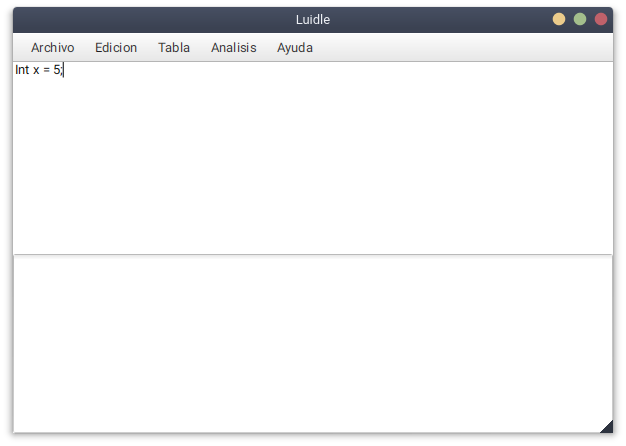
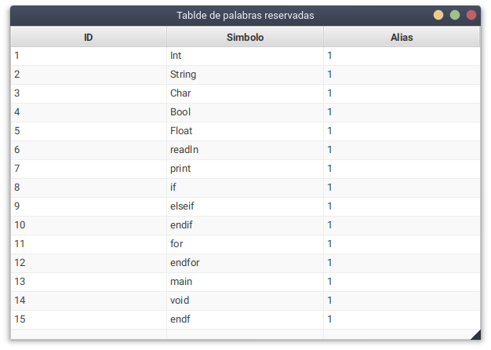
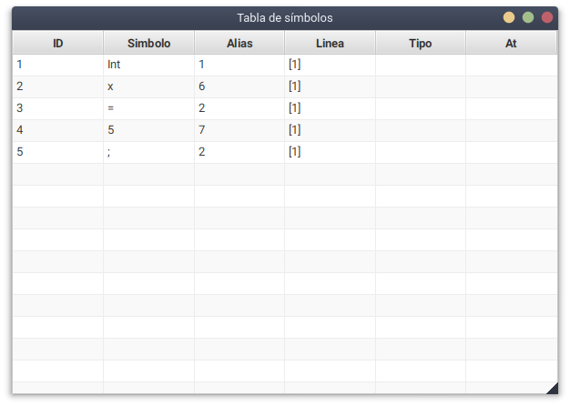

# Luidle

## About

A text editor and parser made with JavaFX and Java CUPS.

## How to run

* You need to have gradle and java 8+ installed

```
$ gradle build
$ gradle run
```

## Screenshots

### Editor



Uses .prg extension

### Keywords



### Lexical tokens


